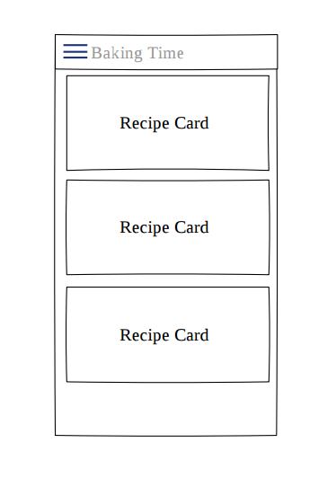
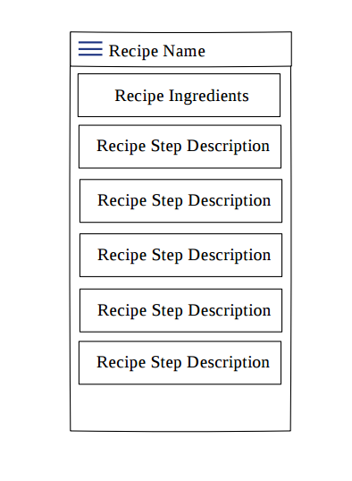
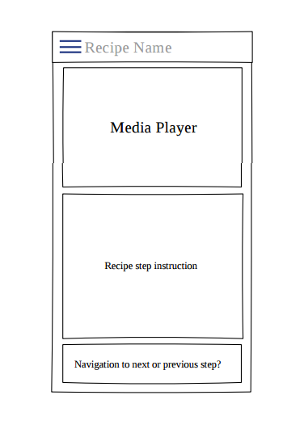
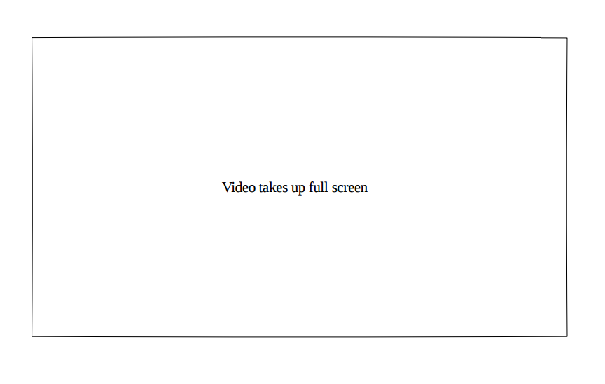
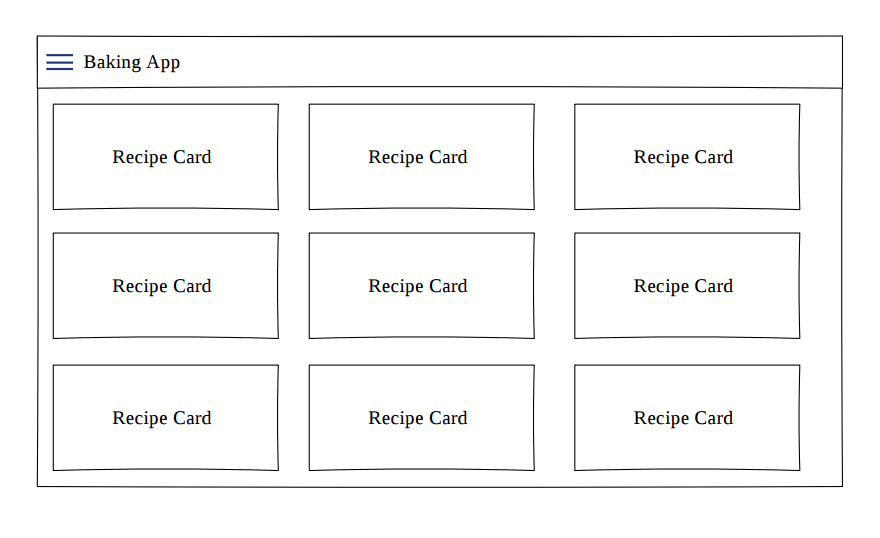
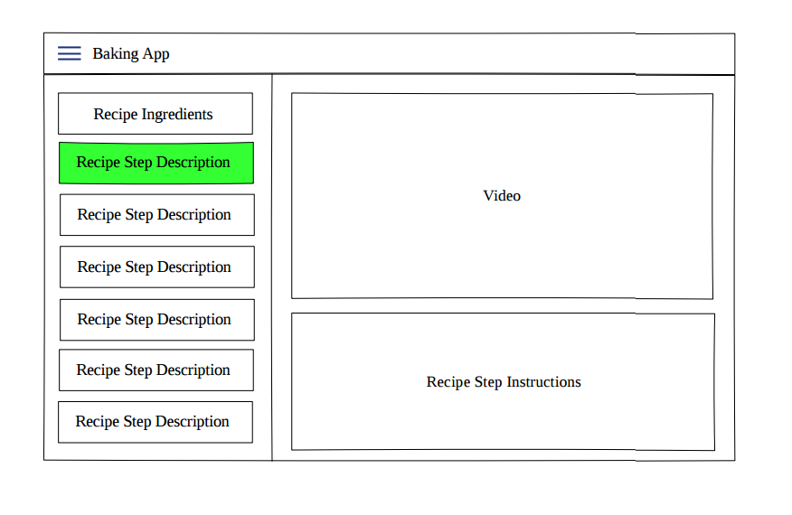

# Sample Mocks
Here are some sample mocks that you can refer to as you build your app. Make sure your app functions properly on tablet devices as well as phones.

## Select a Recipe - Portrait (Phone)

## Select Recipe Detail View - Portrait (Phone)
Note that these step views are not necessarily cards. Be aware that over "cardifying" can make information hard to scan (Material Design guidelines).

## Select Recipe Step Detail View - Portrait (Phone)

## Select Recipe Step Detail View - Landscape (Phone)

## Select a Recipe (Tablet)

## Select and View Recipe Step Detail - (Tablet)

